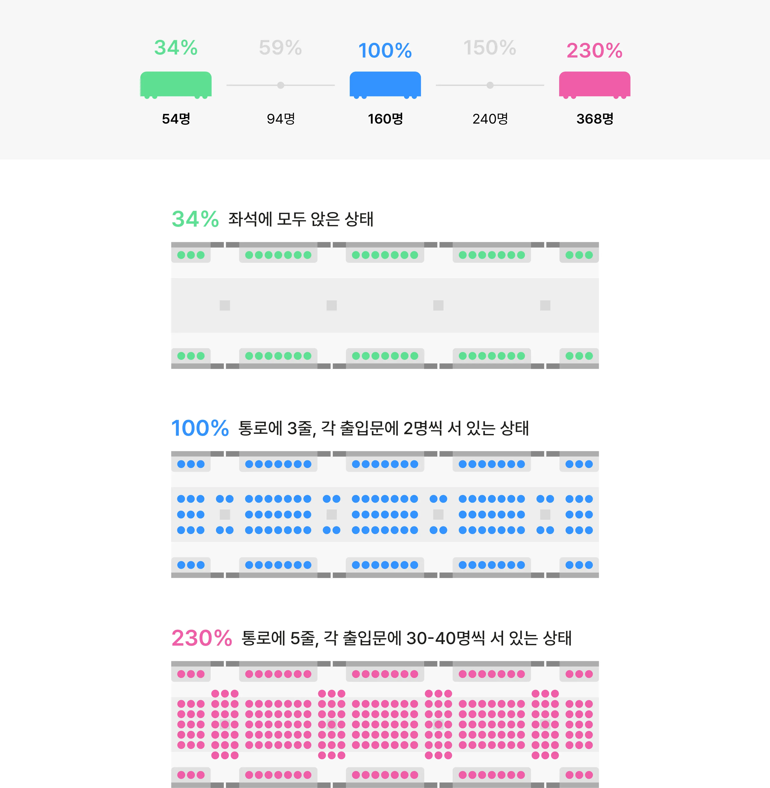

# Realtime Crowded Subway

This app provides real time congestion information for the Seoul Metro lines and their respective quickest paths.

## How to Run

```bash
pip install -r requirements.txt
cd flask_app
flask --app application run
```

## Glossary

### Congestion

Congestion is measured as the amount of passengers on board over the expected amount of passengers.
In the case of the Seoul Metro Line, this expected amount is 160. Thus, when there are 160 passengers on board, the congestion level is equal to 100%.

- 54 passengers (34%) : Every passenger has a seat.
- 160 passengers (100%) : Three lines of standing passengers in the corridor.
- 368 passengers (230%) : Five lines of standing passengers in the corridor.



## To be Implemented

- Congestion levels for each subway train and if possible, the respective wagons.
- Paths from Metro Station A to Metro Station B.
  - Fastest path.
  - Least transfers path.
  - Least congested path.
- Real time subway delay information.
