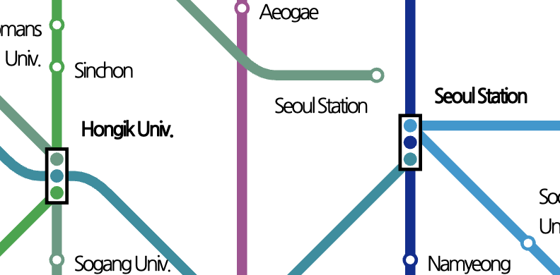

# TOPIS Real-time Subway Arrival Information API

The TOPIS API provides real-time subway arrival information when provided the desired subway station.

## User Guide
The TOPIS API can be called as follows for the Seoul Metro Station.

`http://swopenAPI.seoul.go.kr/api/subway/(인증키)/xml/realtimeStationArrival/0/5/서울`

### Output
| No |	출력명 | 출력설명 |
|----|------|-----|
| 공통 |	list_total_count |	총 데이터 건수 (정상조회 시 출력됨) |
| 공통 |	RESULT.CODE |	요청결과 코드 (하단 메세지설명 참고) |
| 공통 |	RESULT.MESSAGE | 요청결과 메시지 (하단 메세지설명 참고) |
| 1 |	subwayId |	지하철호선ID (1001:1호선, 1002:2호선, 1003:3호선, 1004:4호선, 1005:5호선 1006:6호선, 1007:7호선, 1008:8호선, 1009:9호선, 1061:중앙선1063:경의중앙선, 1065:공항철도, 1067:경춘선, 1075:수의분당선 1077:신분당선, 1092:우이신설선, 1093:서해선, 1081:경강선) |
| 2 |	updnLine |	상하행선구분 (0 : 상행/내선, 1 : 하행/외선) |
| 3 |	trainLineNm |	도착지방면 (성수행(목적지역) - 구로디지털단지방면(다음역)) |
| 5 |	statnFid |	이전지하철역ID |
| 6 |	statnTid |	다음지하철역ID |
| 7 |	statnId |	지하철역ID |
| 8 |	statnNm |	지하철역명 |
| 9 |	trnsitCo |	환승노선수 |
| 10 |	ordkey |	도착예정열차순번 (상하행코드(1자리), 순번(첫번째, 두번째 열차 , 1자리), 첫번째 도착예정 정류장 - 현재 정류장(3자리), 목적지 정류장, 급행여부(1자리)) |
| 11 |	subwayList |	연계호선ID (1002, 1007 등 연계대상 호선ID) |
| 12 |	statnList |	연계지하철역ID (1002000233, 1007000000) |
| 13 |	btrainSttus |	열차종류 (급행,ITX,일반,특급) |
| 14 |	barvlDt |	열차도착예정시간 (단위:초) |
| 15 |	btrainNo |	열차번호 (현재운행하고 있는 호선별 열차번호) |
| 16 |	bstatnId |	종착지하철역ID |
| 17 |	bstatnNm |	종착지하철역명 |
| 18 |	recptnDt |	열차도착정보를 생성한 시각 |
| 19 |	arvlMsg2 |	첫번째도착메세지 (도착, 출발 , 진입 등) |
| 20 |	arvlMsg3 |	두번째도착메세지 (종합운동장 도착, 12분 후 (광명사거리) 등) |
| 21 |	arvlCd |	도착코드 (0:진입, 1:도착, 2:출발, 3:전역출발, 4:전역진입, 5:전역도착, 99:운행중) |

### How it works
After trying out several options, I was able to find out that the responses for stations with no transfers are pretty straightforward, returning only results for the immediate incoming or outgoing subways (Usually returned 4 subways for Sinchon or Ewha Univ.) 

However, once transfers were possible, the amount of trains returned would rise drastically. For example, Seoul Station returned an outstanding 19 trains, including trains from Line 4 (1004), Line 1 (1001), Airport Line(1065) and 경의중앙 (1063) Line. However, one thing to take into account in South Korean Metro lines is that there are two Seoul Station buildings and thus they are represented separately in the maps as well.

When testing with City Hall, Line 1 returned 8 trains while Line 2 returned 4 trains. We must find out why Line 1 has more trains than Line 2.

### Issues
The Open API userguide would provide a different API from real time subway data. 'CardSubwayStats' would be called instead as follows:

`http://openapi.seoul.go.kr:8088/sample/xml/CardSubwayStatsNew/1/5/`

The CardSubwayStats API provides information about the subways that run at specific times when provided the use date required. It can also take in various optional variables such as required time or administrative division (ADSTRD_CODE/자치구).

This URL will in turn return information about the respective subway statistics at the specified date or time. It appears to return past subway information.

**Date-wise Limitations**:
At the time of writing this publication, the API wasn't able to return proper information for the last two days. The date of writing was 2023-11-20 while the last successful request was 2023-11-18.

**Time-wise Limitations**:
The CardSubwayStats API is unable to return values for 2023-11-18. The last time values it can return are those for 2023-11-17.